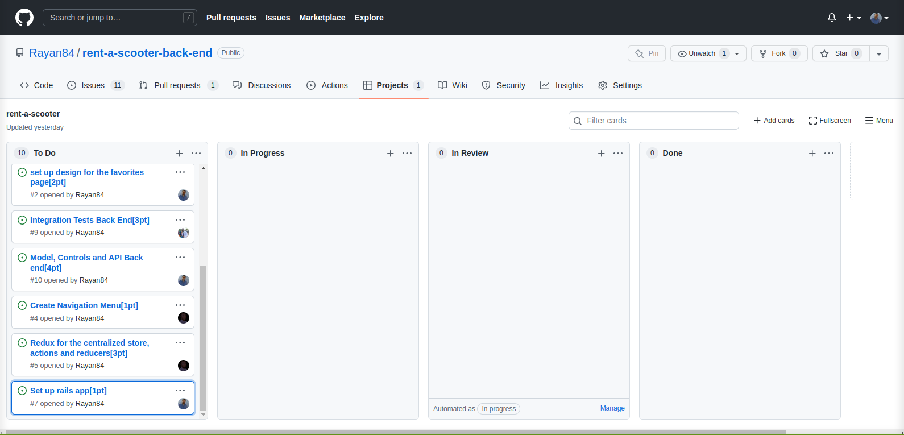

# rent-a-scooter-back-end

Backend application for user accounts creation and authentication, add and remove items to user reservations. The application also provides and api for items (scooters) names, prices, photos and descriptions.

## Built With

- Ruby version 3.0.1
- RoR version 7.0.2.4
- VScode
- Rubocop
- Git and GitHub
## Getting Started

This back-end application will receive POST requests to create user accounts, items and reservations, and GET requests to view scooters and reservations.

There are two ways to use this application, online using the base URL and the endpoints, or clone it to your local machine, below is the explanation for both of the approaches.


## Online
The base URL is: https://cryptic-anchorage-52984.herokuapp.com

### For items (scooters)

To view all the items:

method: GET

endpoint: /api/v1/items

The API will return a JSON object similar to:

```
[
  {
    "id": 1,
    "name": "XS 420 model",
    "price": 1500,
    "image": "https://www.voordeelscooters.nl/media/catalog/product/cache/cf22dcdb6d2158713bbbed88e2c091bb/s/e/senzo_urban_euro5.png",
    "created_at": "2022-01-01T00:00:00.000Z",
    "updated_at": "2022-01-01T00:00:00.000Z",
    "description": "A modern electric scooter, packed with features ...etc "
  },
  {
    "id": 2,
    "name": "Z512 420 model",
    "price": 2200,
    "image": "https://www.motor.nl/wp-content/uploads/2022/03/2022-Yamaha-E01-00.jpg",
    "created_at": "2022-01-01T00:00:00.000Z",
    "updated_at": "2022-01-01T00:00:00.000Z",
    "description": "This is an electric scooter, ...etc " 
  }
]
```

To view details of a particular item:

method: GET

endpoint: /api/v1/items/:id
### For user account sign up

method: POST

endpoint: /signup 

The API expects to receive a JSON content similar to:

```
  {
    "user":
      {
        "email": "example@domain.com",
        "password": "password"
      }
  }

```

### For user log in

method: GET

endpoint: /login

The API expects to receive a JSON content similar to:

```
  {
    "user":
      {
        "email": "example@domain.com",
        "password": "password"
      }
  }

```

### For reservations
To view reservations:

method: GET

endpoint: /api/v1/reserveds/:user_id

The API will return content in JSON form with the following format:

```
{
  "id": 1,
  "user_id": 1,
  "item_id": 1,
  "created_at": "2022-01-01T00:00:00.000Z",
  "updated_at": "2022-01-01T00:00:00.000Z",
}

```

For full API documentation please check [API-Documentation](./swagger/v1/swagger.yaml) 

## Local Machine

- **The project comes shipped with linters config for ruby, so ensure you have Rubocop installed in your local environment**

- **Ensure you have postgresql, nodejs, ruby and rails set up on your machine**

- **To get a local copy of the repository please run the following commands on your terminal:**
`$ git clone https://github.com/Rayan84/rent-a-scooter-back-end.git`

- **$ to test or consume the api you can git clone this react app [front-end](https://github.com/phelian23/rent-item-frontend.git) and set up locally**

- **$ run `bundle install` to couple all dependacies in gem files**
- **$ run `rails db:create db:migrate db:seed`**
- **$ run `rails s` to start rails server**

## Kanban Board

Here you will see some images of our Kanban boards at the beggining of the project.

Initial Kanban Board:


Final Kanaban Board
[Kanban Board Link](https://github.com/Rayan84/rent-a-scooter-back-end/projects/1)

## Authors

Our team is composed of:

👤 **Oluwafemi Awoyemi**
- GitHub: [@phelian23](https://github.com/phelian23)
- LinkedIn: [Oluwafemi Awoyemi](https://www.linkedin.com/in/oluwafemi-awoyemi/)

👤 **Munsa Mibenge**
- GitHub: [@Munsa1](https://github.com/Munsa1)
- LinkedIn: [@Munsa1](https://www.linkedin.com/in/munsa-mibenge/)

👤 **Rayan Rassam**
- GitHub: [@Rayan84](https://github.com/Rayan84)
- LinkedIn: [@Rayan84](https://www.linkedin.com/in/rayan-rassam/)

## 🤝 Contributing

Contributions, issues, and feature requests are welcome!

Feel free to check the [issues page](../../issues/).

## Show your support

Give a ⭐️ if you like this project!

## Acknowledgments

- [Alexey Savitskiy](https://www.behance.net/alexey_savitskiy) for the awesome [design](https://www.behance.net/gallery/37706679/Circle-(Landing-page-Dashboard-Mobile-App)) for our front-end.
## 📝 License

- This project is [MIT](./LICENSE) licensed.
